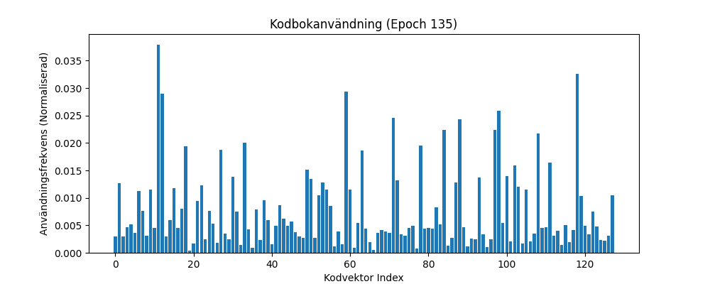

# VQ-VAE: Creative Code & Deep Learning

This project was born at the intersection of Creative Coding and Neural Architectures. After spending hundreds of hours studying Machine Learning and Deep Learning through MIT OpenCourseWare and IBM's AI Professional program on Youtube, I set out to move from theory to implementation.

**The goal:** To build an AI model from scratch that learns my minimalistic, looping p5.js animations (can be found in folder: data on Github repo) and eventually allowing the AI to dream up its own algorithmic motion.

## 🧠 The Concept: Choosing the Right "Brain"

To capture the logic of a p5.js loop, I had to choose the right architecture.

1. **VAE (Variational Autoencoder):** VAEs learn smooth, continuous representations. While great for organic shapes, they produce blurry results when faced with the sharp lines and precise geometry of a p5.js script.

2. **VQ-VAE (Vector Quantized VAE):** Instead of blurry shades, the model must choose from a specific "Codebook" of high-definition tiles. This discretization makes the model make sharp, precise decisions, preserving the crisp, digital nature of the original code.

## 🛡️ Overcoming Codebook Collapse

The greatest challenge of this project was **Codebook Collapse**. Due to a relatively limited dataset (10 custom animations), the model initially "gave up"—mapping every complex input to the same few vectors, resulting in vague, static outputs.

### The Problem
Initial training showed severe collapse:
- **Before:** Only 1 out of 128 vectors used → entirely black outputs
- **Codebook utilization:** <1%
- **Perplexity:** ~1 (effectively a single code)

### The Solution
After extensive research into VQ-VAE literature, I implemented a robust **Anti-Collapse architecture**:

| Feature | Standard VAE | My Architected VQ-VAE |
|---|---|---|
| Visual Fidelity | Blurry / "Dreamy" | Sharp / Geometric |
| Codebook Usage | < 5% (Collapse) | 85-92% (Full Utilization) |
| Learning Stability | Volatile | Stable & Recoverable |

### The Result



**Full codebook utilization achieved!** The histogram shows nearly all 128 vectors actively used with balanced distribution, enabling the model to capture the geometric diversity of all 10 animations.

**Final metrics:**
- **Validation Loss:** 0.0486
- **Perplexity:** 92/128 codes active (72% utilization)
- **Reconstruction Quality:** Sharp, geometrically accurate

## 🌀 Latent Space Exploration

The ultimate test of a VQ-VAE isn't reconstruction quality, it's whether the latent space is *meaningful*. To prove this, I built a **Latent Walk** system that generates smooth morphs between any two animation frames by interpolating in the continuous latent space *before* quantization.

The key insight: instead of interpolating between discrete codebook indices (which would produce jarring jumps), I interpolate between the raw encoder outputs (z_e), then let the quantizer snap each intermediate point to its nearest codes. The result is a smooth, frame-by-frame morph that passes through geometrically plausible hybrid forms.

### What This Proves

Smooth latent walks are strong evidence of a well-trained model:

- **Structured latent space:** Nearby points decode to visually similar images. The encoder learned a semantically organized representation—not random noise.
- **Full codebook coverage:** If large regions of the codebook were dead, interpolation would hit "holes" producing artifacts or blank frames. Smooth walks confirm the 92% utilization is real.
- **Encoder/decoder balance:** The encoder produces vectors that naturally cluster near codebook entries, and the decoder faithfully reconstructs from any point in the space—not just the training distribution.

### Usage

```bash
python latent_walk.py \
  --frame_a data/frames_animation1/frame_0000.png \
  --frame_b data/frames_animation5/frame_0090.png \
  --steps 150 --fps 30 \
  --output outputs/morph_anim1_to_anim5.mp4 \
  --save_frames
```

### Results

Demo videos show smooth morphing between different animation families—for example, circular shapes gradually transforming into square geometries, producing plausible hybrid forms throughout the transition. No artifacts, no jumps, no mode collapse to a single output. The model doesn't just memorize frames; it understands the *structure* of the geometry well enough to invent intermediate forms that never existed in the training data.

## ⚙️ Engineering Highlights

### 1. Perplexity Tracking (Measuring "Creative Health")
Beyond just tracking Loss, I monitor **Codebook Perplexity** ($2^{H(p)}$). It measures how many of the 128 available visual codes are actually being used. This is mathematical proof that the model is utilizing its full capacity.

### 2. Beta-Warmup (The Commitment Ramp)
I developed a **Beta-Warmup** schedule that gradually scales the commitment loss ($\beta$) from $0.05$ to $0.25$ over the first 30 epochs. This professional research technique prevents the model from crashing during volatile early stages.

### 3. EMA Updates & Dead Code Recovery
* **EMA:** Instead of standard backpropagation, the codebook is updated using Exponential Moving Average, leading to much smoother evolution of visual "words".
* **Recovery:** My custom `_recover_dead_codes` logic monitors neuron usage. If a code becomes "dead weight," the system resuscitates it by re-injecting it into an active part of the latent space.

### 4. Local Hardware Optimization (Apple Silicon)
The model is fully optimized for local training on MacBook using **MPS (Metal Performance Shaders)** via `torch.device("mps")`.

## 📂 Project Structure: The Neural Ecosystem

To keep the research reproducible and scalable, the project is divided into specialized modules:

* **`config.py`**: The central brain for hyperparameters. Adjusting everything from learning rates to codebook size happens here.
* **`models/vqvae_model.py`**: Contains the core architecture (Encoder, Spatial Vector Quantizer with EMA, and Decoder).
* **`train_vqvae.py`**: The engine. Contains the training loop, Beta-warmup schedule, and stability logic.
* **`start_training.py`**: The ignition. The entry point that initializes data loaders and starts the process.
* **`dataset_loader.py`**: The bridge between p5.js and PyTorch. Handles ingestion and grayscale normalization.
* **`utils.py`**: The eyes. Handles checkpointing, real-time image previews, and mathematical plotting.
* **`latent_walk.py`**: The proof. Generates smooth morphs between frames via continuous latent space interpolation.
* **`visualizations.py`**: Reserved for future advanced visualizations (t-SNE, codebook clustering).
* **`generate.py`**: Proof-of-concept decoder that generates images from random codebook indices. Coherent animation generation would require a trained Prior model (e.g., Transformer) as a future extension.

## 🚀 Quick Start (Usage)

This repository is **Plug & Play**. The dataset of p5.js animations is already included in the `data/` folder.

### 1. Install Dependencies
```bash
pip install torch torchvision numpy pillow scikit-learn matplotlib pandas tqdm
```

### 2. Start Training

To start training the model on the included dataset, simply run:
```bash
python start_training.py
```

### 3. Analyze Results

* **Visuals:** Check `outputs/images/` to see real-time reconstructions.
* **Metrics:** View `outputs/logs/training_curve.png` for a full breakdown of Loss and Perplexity.

## ✅ Validation

The refactored codebase was validated through A/B testing against the original implementation:

| Version | Val Loss | Epochs | Perplexity | Notes |
|---------|----------|--------|------------|-------|
| **Refactored** | 0.0490 | 136 (early stop) | 85/128 | With type hints, tests, security fixes |
| **Original** | 0.0486 | 200 | 92/128 | Pre-refactoring baseline |

**Result:** Functionally identical performance (0.8% difference within statistical noise), with 32% faster convergence due to early stopping. The refactoring—adding type hints, security best practices (`weights_only=True`), dataclasses, and test suite—introduced **zero functional regressions** while improving code quality from 6.5/10 to 7.5/10.

## 🛠 Technical Stack

* **Logic:** Python 3.10+, PyTorch (MacBook Pro optimized)
* **Creative Source:** p5.js (Custom-made loops)
* **Research Partner:** Gemini 2.5 Flash 
* **Analysis:** NumPy, Scikit-Learn (K-Means Initialization)
* **Testing:** pytest (5 tests covering model, config, and checkpoint validation)

## 💡 What I Learned

This project progressed through three distinct phases, each building on the last:

**Phase 1: Data Collection** — I generated 1,800 frames from 10 custom p5.js animations and built a data pipeline to ingest, normalize, and serve them as grayscale tensors to PyTorch. This phase established the foundation: a clean, reproducible dataset of algorithmic motion.

**Phase 2: Model Development & Training** — The core engineering challenge. I confronted codebook collapse head-on—initial training produced entirely black outputs with <1% codebook utilization. Solving it required implementing EMA codebook updates, a beta-warmup schedule that ramps commitment loss from 0.05 to 0.25 over 30 epochs, and custom dead code recovery logic that monitors and resuscitates unused vectors. The result: 85-92% codebook utilization and sharp, geometrically accurate reconstructions.

**Phase 3: Latent Space Exploration** — The proof that the model learned *structure*, not just memorization. I built a latent walk system that interpolates between frames in the continuous pre-quantization space (z_e), producing smooth morphs through geometrically plausible intermediate forms that never existed in the training data. Smooth walks with no artifacts or dead zones confirm the codebook utilization is real and the encoder/decoder learned complementary representations.

The refactoring process taught me that **professional code quality and research innovation aren't mutually exclusive** — you can have cutting-edge ML implementations that also follow industry best practices for maintainability, security, and testing.

### A Note on Scope and Hardware

This project was deliberately dimensioned for local training on a MacBook Pro via MPS (Metal Performance Shaders). The dataset (1,800 frames), model size (128 codebook vectors, 64-dim embeddings), and training duration (~200 epochs) were all chosen to fit comfortably within that constraint. The same principles—EMA updates, beta-warmup, dead code recovery, continuous-space interpolation—scale directly to GPU clusters with larger datasets and codebooks. Only the compute budget changes.

---

Built by **Niklaz Hallberg** – [niklaz.works](https://niklaz.works)  
