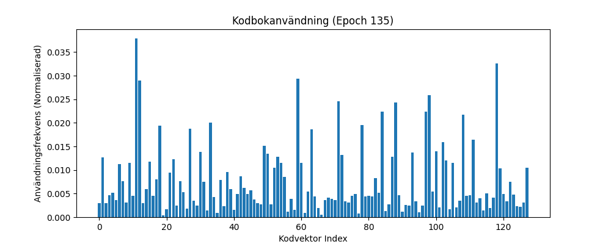
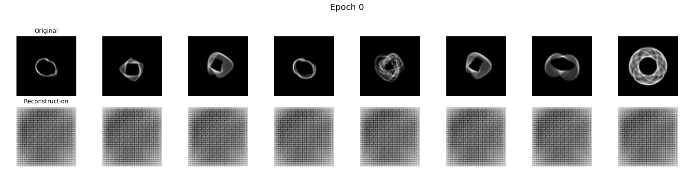
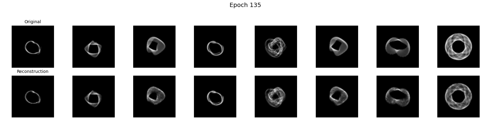

# VQ-VAE: Creative Code & Deep Learning

**A creative-ML experiment: train a VQ-VAE on original p5.js animation frames, then explore the learned latent space through reconstructed loops and interpolated morphs.**

## Overview

A VQ-VAE built from scratch in PyTorch that learns custom p5.js looping animations. Trained locally on Apple Silicon (MPS) with 1,800 frames across 10 animations. Overcame codebook collapse through EMA updates, beta-warmup scheduling, and dead code recovery, reaching a validation perplexity of ≈ 85–92 of 128 codes in the documented runs. The model generates smooth latent morphs between animation families — producing new frames that never existed in the training data.

This project was born at the intersection of Creative Coding and Neural Architectures. After spending hundreds of hours studying Machine Learning and Deep Learning through MIT OpenCourseWare and IBM's AI Professional program on Youtube, I set out to move from theory to implementation.

**The goal:** to build an AI model from scratch that learns my minimalistic, looping p5.js animations (included in the `data/` folder), as a first step toward letting an AI dream up its own algorithmic motion. That last step, autonomous generation of new animations, is not part of this repository (see [Limitations](#️-limitations)).

## Table of Contents

- [The Concept: Choosing the Right "Brain"](#-the-concept-choosing-the-right-brain)
- [Overcoming Codebook Collapse](#️-overcoming-codebook-collapse)
- [Latent Space Exploration](#-latent-space-exploration)
- [Results](#-results)
- [Engineering Highlights](#️-engineering-highlights)
- [Project Structure](#-project-structure-the-neural-ecosystem)
- [Reproduce the Documented Run](#-reproduce-the-documented-run)
- [Validation](#-validation)
- [Limitations](#️-limitations)
- [Technical Stack](#-technical-stack)
- [What I Learned](#-what-i-learned)
- [License](#-license)

## 🧠 The Concept: Choosing the Right "Brain"

To capture the logic of a p5.js loop, I had to choose the right architecture.

1. **VAE (Variational Autoencoder):** VAEs learn smooth, continuous representations. While great for organic shapes, they tend to produce blurry results when faced with the sharp lines and precise geometry of a p5.js script.

2. **VQ-VAE (Vector Quantized VAE):** Instead of blurry shades, the model must choose from a specific "Codebook" of learned tiles. This discretization pushes the model toward sharp, precise decisions that suit the crisp, digital nature of the original code.

## 🛡️ Overcoming Codebook Collapse

The greatest challenge of this project was **Codebook Collapse**. Due to a relatively limited dataset (10 custom animations), the model initially "gave up", mapping every input to the same few vectors and producing vague, static outputs.

### The Problem
Early training runs, before the fixes below, showed severe collapse (reported from those runs; logs not committed):
- Only 1 out of 128 vectors used → entirely black outputs
- Codebook perplexity ≈ 1 (effectively a single code)

### The Solution
After extensive research into VQ-VAE literature, I implemented an anti-collapse setup: EMA codebook updates, K-Means codebook initialization, a beta warm-up schedule, and dead-code recovery (details under [Engineering Highlights](#️-engineering-highlights)).

| | Collapsed VQ-VAE (early runs) | VQ-VAE with EMA + warm-up + recovery (documented runs) |
|---|---|---|
| Reconstructions | Black / static | Close reconstructions of the source shapes |
| Codebook perplexity | ≈ 1 of 128 | ≈ 85–92 of 128 (reported, see [Results](#-results)) |
| Training behaviour | Collapses early | Recovers dead codes; converges |

### The Result



*Codebook usage on the validation set at epoch 135 (refactored run).* Nearly every one of the 128 vectors is used, so the codebook no longer collapses onto a few codes. Usage is uneven: the most-used codes appear tens of times more often than the rarest ones.

### Visual Progress

The same fixed validation batch at the start and end of training:

**Epoch 0:** the decoder outputs a uniform grey texture. No structure has been learned yet.



**Epoch 135:** the outlines and shapes of all eight validation frames are reconstructed closely. Filled regions show some grain compared with the originals.



The choice of 128 codes was deliberate. For a dataset of 1,800 frames from 10 animations, the codebook size needs to balance expressiveness against trainability. Too few codes (e.g., 32) and the model can't represent the geometric diversity across all 10 animation families, so reconstructions blur together. Too many (e.g., 512+) and the codebook becomes sparse: most vectors never get enough training signal, usage collapses, and you're back to the same failure mode. 128 was the size that worked here. It gives enough "visual words" to capture distinct shapes and lines while staying small enough that each code gets regular updates during local MPS training.

## 🌀 Latent Space Exploration

Reconstruction quality shows that the model can compress and restore frames. It says little about how the latent space is organised. To look at that, I built a **Latent Walk** system that morphs between any two animation frames by interpolating in the continuous latent space *before* quantization.

The key idea: instead of interpolating between discrete codebook indices, which would produce jarring jumps, I interpolate between the raw encoder outputs (z_e) and let the quantizer snap each intermediate point to its nearest codes. The result is a frame-by-frame morph that passes through plausible hybrid forms.

### What this suggests

Smooth latent walks are qualitative evidence that the representation is well structured. They are not proof of semantic understanding or of generalisation beyond this dataset.

- **Structured latent space:** in the walks I ran, nearby points decode to visually similar images.
- **Usable codebook coverage:** the walks did not hit large dead regions that decode to blank frames. This is consistent with the codebook-usage histogram above.
- **Encoder/decoder compatibility:** the decoder produces coherent images for interpolated latents, not only for encodings of training frames.

### Usage

Requires a trained checkpoint at `outputs/checkpoints/vqvae_best.pth` (see [Reproduce](#-reproduce-the-documented-run)). Frames are numbered from `0001` to `0180` per animation:

```bash
python latent_walk.py \
  --frame_a data/frames_animation1/frames_animation1_frame_0001.png \
  --frame_b data/frames_animation5/frames_animation5_frame_0090.png \
  --steps 120 --fps 30 \
  --output outputs/morph_anim1_to_anim5.mp4 \
  --save_frames
```

### Results

The committed [latent walk demo](Images/morph_anim1_to_anim5.mp4) (120 frames at 64×64, 30 fps) morphs between two animation families. In it, circular shapes gradually turn into square geometries through intermediate forms that are not in the training data. These in-between frames come from interpolation between two real frames, not from free generation (see [Limitations](#️-limitations)).

## 📊 Results

| | |
|---|---|
| **Dataset** | 1,800 frames: 10 original p5.js loops × 180 frames. Source PNGs are 1024×1024 RGBA, resized to **64×64 grayscale** model inputs. 90/10 train/validation split, seed 42 |
| **Model** | Encoder downsamples 64×64 → 8×8 latent grid; codebook of 128 × 64-dim vectors |
| **Training environment** | MacBook Pro, Apple Silicon (MPS) |
| **Reported run** | Refactored code, early stop after epoch 135 (136 epochs): **validation loss 0.0490, validation perplexity ≈ 85** |
| **Visual evidence** | Reconstructions at epoch 0 and 135, codebook usage at epoch 135, latent-walk morph, all in [`Images/`](Images/) |

These metrics are **reported from the documented Apple Silicon training run**. They were not re-measured for this README, and the training logs are not committed (`outputs/` is git-ignored).

**How to read the metrics:**
- **Validation loss** is binary cross-entropy reconstruction loss plus the beta-weighted commitment loss, averaged over validation batches.
- **Perplexity** is exp(entropy) of code assignments, computed per validation batch and then averaged. It is an *effective* number of codes in use, not a count of distinct active codes. A perplexity of ≈ 85 means assignments are about as spread out as uniform use of 85 codes.

## ⚙️ Engineering Highlights

### 1. Perplexity Tracking (Measuring "Creative Health")
Beyond tracking loss, I monitor **codebook perplexity**, exp(H(p)) over code assignments. It estimates how many of the 128 visual codes are effectively in use, and is the main early-warning signal for codebook collapse.

### 2. Beta-Warmup (The Commitment Ramp)
A **beta warm-up** schedule gradually scales the commitment loss weight ($\beta$) from $0.05$ to $0.25$ over the first 30 epochs. Keeping the commitment pressure low early on gave the encoder room to spread out before being pulled toward the codebook, which reduced early collapse in my runs.

### 3. EMA Updates & Dead Code Recovery
* **EMA:** Instead of gradient updates, the codebook is updated with an Exponential Moving Average of assigned encoder outputs, which gives a smoother evolution of the visual "words".
* **Recovery:** A custom `_recover_dead_codes` routine monitors code usage. If a code becomes "dead weight", it is re-initialized either from a random encoder output in the current batch or from a popular code plus noise.

### 4. Local Hardware (Apple Silicon)
Training runs locally on a MacBook via **MPS (Metal Performance Shaders)**. The device is selected automatically in the order MPS → CUDA → CPU.

## 📂 Project Structure: The Neural Ecosystem

To keep the research reproducible, the project is divided into specialized modules:

* **`config.py`**: The central brain for hyperparameters. Adjusting everything from learning rates to codebook size happens here.
* **`models/vqvae_model.py`**: Contains the core architecture (Encoder, Spatial Vector Quantizer with EMA, and Decoder).
* **`train_vqvae.py`**: The engine. Contains the training loop, Beta-warmup schedule, and stability logic.
* **`start_training.py`**: The ignition. The entry point that initializes data loaders and starts the process. It takes no command-line arguments; running it starts training immediately.
* **`dataset_loader.py`**: The bridge between p5.js and PyTorch. Handles ingestion, resizing and grayscale normalization.
* **`utils.py`**: The eyes. Handles checkpoint lookup, reconstruction previews, codebook-usage plots, and the training-curve plot.
* **`latent_walk.py`**: The explorer. Generates smooth morphs between two frames via continuous latent-space interpolation.
* **`visualizations.py`**: Reserved for future advanced visualizations (t-SNE, codebook clustering).
* **`generate.py`**: Proof-of-concept decoder that decodes *random* codebook indices into single images. Coherent animation generation would require a trained prior model (e.g., a Transformer) as a future extension.

## 🚀 Reproduce the Documented Run

The dataset of p5.js animations is included in `data/`. No pretrained weights are included, so you train your own.

### 1. Install dependencies

Python 3.10+ is required.

```bash
python3 -m venv .venv && source .venv/bin/activate
pip install -r requirements.txt
```

### 2. Run the tests

```bash
python -m pytest
```

### 3. Train

Run all scripts **from the repository root**, since paths such as `data/` and `outputs/` are relative:

```bash
python start_training.py
```

`start_training.py` has no command-line arguments; all settings live in `config.py`. With the defaults, training runs for up to 200 epochs with early stopping (patience 15). On an Apple Silicon MacBook, an epoch takes on the order of 20 seconds.

### 4. Inspect results

* **Reconstructions:** `outputs/images/ema_recon_epoch_XXXX.png`, saved every 5 epochs.
* **Codebook usage:** `outputs/logs/codebook_usage_epoch_XXXX.png`, saved every 5 epochs.
* **Metrics:** `outputs/logs/training_log.csv`, one row per epoch.
* **Checkpoints:** `outputs/checkpoints/vqvae_best.pth` (lowest validation loss).
* **Training curve:** the training loop does not draw it automatically. Generate it with:
  ```bash
  python -c "from utils import plot_training_curve; plot_training_curve()"
  ```

### 5. Explore the latent space

```bash
python latent_walk.py \
  --frame_a data/frames_animation1/frames_animation1_frame_0001.png \
  --frame_b data/frames_animation5/frames_animation5_frame_0090.png \
  --steps 120 --fps 30 --output outputs/morph_anim1_to_anim5.mp4

python generate.py --num_samples 4   # random-code decoding, see Limitations
```

Expect results *similar* to the documented run, not identical ones. See [Limitations](#️-limitations).

## ✅ Validation

After a refactor (type hints, dataclass config, `weights_only=True` checkpoint loading, and a test suite), I retrained and compared the result against the original implementation. Both rows are **reported from the documented Apple Silicon training runs**. Each is a single run:

| Version | Val Loss | Epochs | Val perplexity | Notes |
|---------|----------|--------|------------|-------|
| **Refactored** | 0.0490 | 136 (early stop) | ≈ 85 | With type hints, tests, security fixes |
| **Original** | 0.0486 | 200 | ≈ 92 | Pre-refactoring baseline |

**Result:** the refactored code reached a comparable validation loss (0.8% higher) and stopped early after 136 epochs instead of running all 200. One run per version is not enough to tell whether the small differences in loss and perplexity are meaningful. The comparison shows no evidence of a regression, but it does not prove equivalence.

The test suite (`tests/test_basic.py`) consists of 5 fast tests on random inputs. They check tensor shapes through the encoder, decoder and full model, the encode→decode index roundtrip, and that reconstructions stay in [0, 1]. They do not test training dynamics, EMA updates or dead-code recovery.

## ⚠️ Limitations

- **Reconstruction and interpolation, not generation of new animations.** No temporal prior (e.g. a Transformer over code sequences) is trained. The model therefore cannot autonomously generate coherent new animations over time. It reconstructs frames and creates interpolation-based morphs between frames in its learned image-latent space. `generate.py` decodes *random* code grids, which yields single images without temporal coherence.
- **Frame model, not a video model.** Every frame is encoded independently as a 64×64 grayscale image. Motion is only implicit in the frame order.
- **Small, curated dataset.** 1,800 frames from 10 animations by one author, with a random frame-level train/validation split. Validation frames therefore come from the same loops as training frames, so the validation loss measures reconstruction of held-out frames of *known* animations, not generalisation to new ones.
- **No pretrained weights** are included. Reproducing the results requires training locally.
- **Reproducibility is approximate.** Seeds are fixed, but MPS/GPU kernels are not bit-for-bit deterministic. Results may vary across runs, hardware, and PyTorch versions.
- **Training logs from the documented runs are not committed.** The reported metrics cannot be re-derived from this repository without retraining.

## 🛠 Technical Stack

* **Logic:** Python 3.10+, PyTorch (trained on MacBook Pro / MPS)
* **Creative Source:** p5.js (Custom-made loops)
* **Research Partner:** Gemini 2.5 Flash
* **Analysis:** NumPy, scikit-learn (K-Means codebook initialization)
* **Media:** imageio + imageio-ffmpeg (latent-walk video export)
* **Testing:** pytest (5 shape and range tests)

## 💡 What I Learned

This project progressed through three distinct phases, each building on the last:

**Phase 1: Data Collection** — I generated 1,800 frames from 10 custom p5.js animations and built a data pipeline to ingest, normalize, and serve them as grayscale tensors to PyTorch. This phase established the foundation: a clean, reproducible dataset of algorithmic motion.

**Phase 2: Model Development & Training** — The core engineering challenge. I confronted codebook collapse head-on—initial training produced entirely black outputs with <1% codebook utilization. Solving it required implementing EMA codebook updates, a beta-warmup schedule that ramps commitment loss from 0.05 to 0.25 over 30 epochs, and custom dead code recovery logic that monitors and resuscitates unused vectors. The result: a validation perplexity of ≈ 85–92 of 128 codes in the documented runs, and reconstructions that closely match the source geometry.

**Phase 3: Latent Space Exploration** — Qualitative evidence that the model learned structure, not just individual frames. I built a latent walk system that interpolates between frames in the continuous pre-quantization space (z_e), producing smooth morphs through geometrically plausible intermediate forms that never existed in the training data. The walks showed no dead zones or blank frames, which is consistent with the codebook usage measured during training and suggests the encoder and decoder learned complementary representations.

The refactoring process taught me that **code quality and research experimentation aren't mutually exclusive**. An experimental ML implementation can also have typed configuration, safer checkpoint loading, and tests.

### A Note on Scope and Hardware

This project was deliberately dimensioned for local training on a MacBook Pro via MPS (Metal Performance Shaders). The dataset (1,800 frames), model size (128 codebook vectors, 64-dim embeddings), and training budget (up to 200 epochs) were all chosen to fit within that constraint. The techniques used (EMA updates, beta warm-up, dead-code recovery, continuous-space interpolation) are standard in larger VQ-VAE work too. How well these specific settings transfer to bigger datasets and codebooks has not been tested here.

## 📄 License

- **Source code** is released under the [MIT License](LICENSE).
- **Creative assets are not MIT-licensed.** The original p5.js animation frames in `data/`, the visual material in `Images/`, and any included example media are © Niklaz Hallberg, all rights reserved. They may not be reused, redistributed, or used for model training without written permission. See [ASSETS_LICENSE.md](ASSETS_LICENSE.md).

---

Built by **Niklaz Hallberg** – [niklaz.works](https://niklaz.works)
